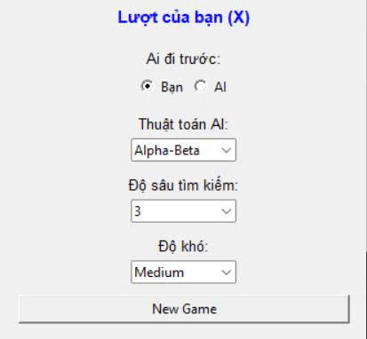
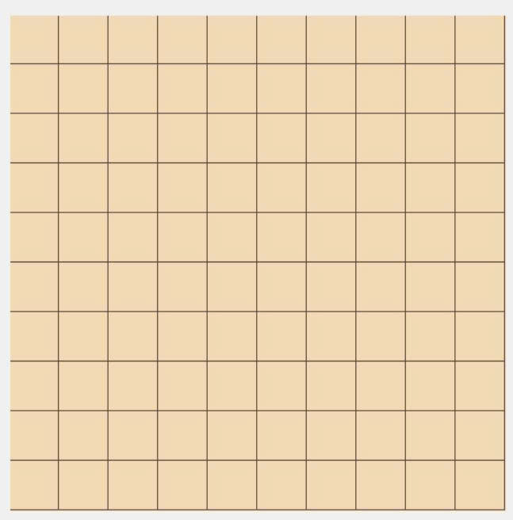
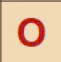
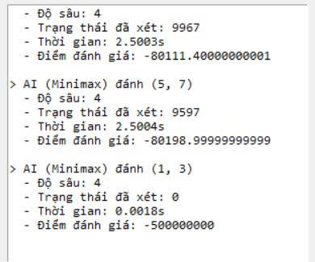

[README.md](https://github.com/user-attachments/files/28016454/README.md)
# Caro AI - Minimax / Alpha-Beta

Dự án này xây dựng chương trình **chơi cờ Caro giữa người chơi và máy tính** bằng Python. Người chơi dùng quân **X**, máy tính dùng quân **O**. AI có thể lựa chọn nước đi bằng hai thuật toán: **Minimax** và **Alpha-Beta pruning**. Chương trình có giao diện đơn giản bằng **Tkinter** và chạy trực tiếp bằng Python.

---

## 1. Mô tả chương trình

* Bàn cờ kích thước **10 x 10**, đạt yêu cầu tối thiểu của đề bài là từ **9 x 9** trở lên.
* Hai bên lần lượt đánh quân vào các ô trống.
* Một bên thắng khi có **4 quân liên tiếp** theo hàng ngang, hàng dọc hoặc đường chéo.
* Không xét luật chặn hai đầu.
* AI hỗ trợ hai thuật toán:

  * **Minimax**: duyệt cây trò chơi theo độ sâu tìm kiếm đã chọn.
  * **Alpha-Beta**: cải tiến từ Minimax bằng cách cắt nhánh để giảm số trạng thái cần xét.
* Giao diện cho phép chọn:

  * Người chơi hoặc AI đi trước.
  * Thuật toán AI: Minimax hoặc Alpha-Beta.
  * Độ sâu tìm kiếm.
  * Độ khó / giới hạn thời gian suy nghĩ.

---

## 2. Cấu trúc thư mục

Khi nộp hoặc chạy project, nên sắp xếp thư mục như sau. Thư mục **assets/** được đặt phía trên **source_code/** và chứa các ảnh minh họa hoặc ảnh dùng cho README.

```text
23021337_23021307_CaroAI/
├── assets/
│   ├── danhgia.jpg             # Ảnh bảng đánh giá / kết quả so sánh thực nghiệm
│   ├── menu_board.jpg          # Ảnh giao diện menu và bàn cờ khi mở game
│   ├── board.jpg               # Ảnh minh họa bàn cờ
│   ├── O.jpg                   # Ảnh / ký hiệu quân O của AI
│   └── X.jpg                   # Ảnh / ký hiệu quân X của người chơi
├── source_code/
│   ├── carogame.py             # File chính: giao diện, luật chơi và AI
│   └── benchmark_caro.py       # Chạy thực nghiệm so sánh Minimax và Alpha-Beta
├── tests/
│   └── test_engine.py          # Test tự động bằng pytest
├── results/
│   └── benchmark_results.csv   # File kết quả thực nghiệm sau khi chạy benchmark
├── requirements.txt            # Danh sách thư viện cần cài
├── run_tests_manual.py         # File kiểm thử thủ công
└── README.md                   # File hướng dẫn chạy chương trình
```

---

## 3. Yêu cầu cài đặt

Máy cần cài:

* **Python 3.10 trở lên**.
* Thư viện trong file `requirements.txt`.

Cài thư viện bằng lệnh:

```bash
pip install -r requirements.txt
```

Nếu máy dùng lệnh `python3` thay cho `python`, có thể thay `python` bằng `python3` trong các câu lệnh bên dưới.

Lưu ý: giao diện sử dụng **Tkinter**. Trên Windows, Tkinter thường có sẵn khi cài Python. Nếu chạy chương trình báo lỗi thiếu `tkinter`, hãy cài lại Python và chọn đầy đủ thành phần `tcl/tk and IDLE`.

---

## 4. Cách chạy game

Mở Command Prompt, PowerShell hoặc Terminal tại thư mục gốc của project, sau đó chạy:

```bash
python source_code/carogame.py
```

Sau khi chạy đúng, cửa sổ game sẽ xuất hiện. Ảnh minh họa giao diện ban đầu:

<p align="center">
  
</p>

---

## 5. Hướng dẫn sử dụng giao diện

Trên giao diện, phần bên trái là **bàn cờ Caro**, phần bên phải là **bảng điều khiển** và vùng hiển thị log.

Các lựa chọn chính:

1. **Ai đi trước**

   * Chọn **Bạn** nếu muốn người chơi đánh trước.
   * Chọn **AI** nếu muốn máy đánh trước.
2. **Thuật toán AI**

   * Chọn **Minimax** để AI dùng thuật toán Minimax thường.
   * Chọn **Alpha-Beta** để AI dùng thuật toán Minimax có cắt nhánh Alpha-Beta.
3. **Độ sâu tìm kiếm**

   * Có thể chọn các độ sâu như **1, 2, 3, 4**.
   * Độ sâu càng lớn thì AI xét được nhiều khả năng hơn, nhưng thời gian chạy lâu hơn.
   * Khi so sánh Minimax và Alpha-Beta, cần dùng cùng một độ sâu để đảm bảo công bằng.
4. **Độ khó**

   * Mức độ khó ảnh hưởng đến giới hạn thời gian suy nghĩ của AI.
   * Nếu muốn AI chạy nhanh hơn, nên chọn độ sâu thấp hoặc mức độ khó thấp hơn.
5. **New Game**

   * Bấm để bắt đầu lại ván mới.
   * Nếu chọn AI đi trước, sau khi bấm **New Game**, AI sẽ tự đánh nước đầu tiên.

Cách chơi rất đơn giản: người chơi bấm chuột vào một ô trống trên bàn cờ để đánh quân **X**. Sau đó AI sẽ suy nghĩ và đánh quân **O**. Vùng log bên phải sẽ hiển thị nước đi AI chọn, độ sâu tìm kiếm, số trạng thái đã xét, thời gian chạy và điểm đánh giá.

Minh họa bàn cờ và quân cờ:

<p align="center">
  
</p>

<p align="center">
  
  &nbsp;&nbsp;&nbsp;
  
</p>

---

## 6. Chạy kiểm thử chương trình

Project có test để kiểm tra một số chức năng cơ bản của engine, ví dụ: phát hiện 4 quân liên tiếp, kiểm tra nước đi hợp lệ và kiểm tra AI có biết chặn khi người chơi sắp thắng.

Chạy test tự động bằng lệnh:

```bash
python -m pytest tests/test_engine.py
```

Chạy test thủ công:

```bash
python run_tests_manual.py
```

Nếu chương trình chạy đúng, kết quả sẽ báo `passed` hoặc `All manual tests passed`.

---

## 7. Chạy benchmark Level 3

Để đáp ứng yêu cầu phân tích thực nghiệm, project có file `benchmark_caro.py` dùng để so sánh Minimax và Alpha-Beta trên nhiều trạng thái bàn cờ khác nhau.

Chạy benchmark bằng lệnh:

```bash
python source_code/benchmark_caro.py
```

Benchmark sẽ chạy hai thuật toán trên cùng trạng thái bàn cờ, cùng hàm đánh giá và cùng độ sâu tìm kiếm. Các độ sâu thường dùng để so sánh là:

```text
Độ sâu 1, 2, 3
```

Kết quả được lưu vào:

```text
results/benchmark_results.csv
```

File kết quả gồm các thông tin chính: tên trạng thái kiểm thử, độ sâu tìm kiếm, thuật toán sử dụng, nước đi AI chọn, điểm đánh giá, số trạng thái đã xét và thời gian chạy. Các số liệu này được dùng để nhận xét Alpha-Beta giảm được bao nhiêu trạng thái so với Minimax và thời gian chạy thay đổi như thế nào khi tăng độ sâu.

Ảnh minh họa bảng đánh giá thực nghiệm:

<p align="center">
  
</p>

---

## 8. Một số lỗi thường gặp

### Lỗi `python is not recognized`

Máy chưa nhận biến môi trường Python. Cách xử lý là cài lại Python, chọn **Add Python to PATH**, sau đó mở lại Command Prompt hoặc PowerShell.

### Lỗi thiếu thư viện

Chạy lại lệnh:

```bash
pip install -r requirements.txt
```

### AI chạy lâu khi chọn độ sâu cao

Đây là hiện tượng bình thường vì số trạng thái tăng rất nhanh khi tăng độ sâu. Nếu muốn AI phản hồi nhanh hơn, hãy giảm **độ sâu tìm kiếm** hoặc chọn mức **độ khó** thấp hơn.

---

Phần báo cáo PDF cần trình bày rõ luật chơi, cách biểu diễn bàn cờ, cách sinh nước đi, kiểm tra thắng/thua, thuật toán Minimax, thuật toán Alpha-Beta, hàm đánh giá, thiết kế trạng thái thử nghiệm, bảng kết quả benchmark và nhận xét về ảnh hưởng của độ sâu tìm kiếm.

